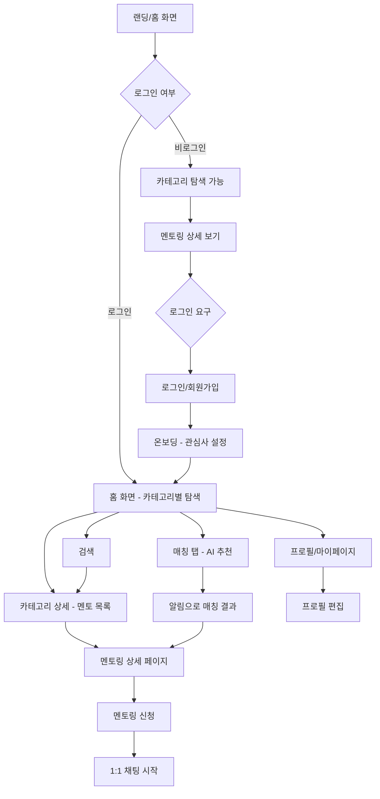

# MentorHub 사용자 플로우

## 1. 메인 플로우

---

## 2. 화면별 플로우

### 화면 1: 로그인/회원가입 (/login, /signup)
- **진입**: 홈 화면에서 로그인 버튼 클릭 또는 로그인 필요 기능 접근 시
- **행동**: 소셜 로그인(Google, Kakao) 또는 이메일 회원가입
- **이탈**: 신규 → 온보딩 / 기존 → 홈

### 화면 2: 온보딩 (/onboarding)
- **진입**: 회원가입 완료 후 자동 진입
- **행동**:
  1. 관심사 카테고리 선택 (복수 선택)
  2. "가르칠 수 있는 것" 설정
  3. "배우고 싶은 것" 설정
  4. 지역 설정
- **이탈**: 홈 화면

### 화면 3: 홈 (/home)
- **진입**: 앱 기본 진입점 (로그인 없이도 접근 가능)
- **행동**:
  - 카테고리 목록 탐색 (음악, 운동, 요리, 프로그래밍 등)
  - 인기 멘토 / 최근 등록 멘토링 확인
  - 카테고리 클릭 → 카테고리 상세로 이동
- **이탈**: 카테고리 상세, 검색, 하단 탭 이동

### 화면 4: 카테고리 상세 (/category/:id)
- **진입**: 홈에서 카테고리 클릭
- **행동**:
  - 해당 카테고리의 멘토 목록 탐색
  - 멘토 카드 클릭 → 멘토링 상세로 이동
  - 필터링 (지역, 요일 등)
- **이탈**: 멘토링 상세, 뒤로가기(홈)

### 화면 5: 멘토링 상세 (/mentoring/:id)
- **진입**: 카테고리 상세에서 멘토 카드 클릭, 또는 매칭 결과에서 클릭
- **행동**:
  - 멘토 프로필 확인 (가르칠 수 있는 것, 경험, 자기소개)
  - 멘토링 정보 확인 (시간, 장소, 내용)
  - 멘토링 신청 버튼 클릭
- **이탈**: 채팅 시작, 뒤로가기

### 화면 6: 검색 (/search)
- **진입**: 하단 탭 "검색" 클릭
- **행동**:
  - 키워드로 멘토/멘토링 검색
  - 검색 결과에서 멘토 카드 클릭
- **이탈**: 멘토링 상세, 카테고리 상세

### 화면 7: 매칭 (/matching)
- **진입**: 하단 탭 "매칭" 클릭 또는 매칭 알림 클릭
- **행동**:
  - AI 추천 멘토 목록 확인
  - 새로운 매칭 알림 확인
  - 추천 멘토 프로필 확인
- **이탈**: 멘토링 상세, 채팅

### 화면 8: 채팅 목록 (/chat)
- **진입**: 하단 탭 "채팅" 클릭
- **행동**:
  - 진행 중인 채팅 목록 확인
  - 채팅방 클릭 → 채팅 상세로 이동
  - 안 읽은 메시지 확인
- **이탈**: 채팅 상세

### 화면 9: 채팅 상세 (/chat/:id)
- **진입**: 채팅 목록에서 채팅방 클릭 또는 멘토링 신청 후 자동 진입
- **행동**:
  - 실시간 메시지 전송/수신
  - 멘토링 장소/시간 협의
  - 상대방 프로필 확인
- **이탈**: 뒤로가기(채팅 목록)

### 화면 10: 프로필/마이페이지 (/profile)
- **진입**: 하단 탭 "프로필" 클릭
- **행동**:
  - 내 프로필 확인 (가르칠 수 있는 것 + 배우고 싶은 것)
  - 프로필 편집 버튼
  - 멘토링 이력 확인
  - 설정 (알림, 로그아웃)
- **이탈**: 프로필 편집, 설정

### 화면 11: 프로필 편집 (/profile/edit)
- **진입**: 프로필에서 편집 버튼 클릭
- **행동**:
  - 자기소개 수정
  - "가르칠 수 있는 것" 수정
  - "배우고 싶은 것" 수정
  - 지역 변경
  - 프로필 이미지 변경
- **이탈**: 저장 → 프로필, 취소 → 프로필

---

## 3. 예외 플로우

### 로그인 실패 시
- 에러 메시지 표시 ("로그인에 실패했어요. 다시 시도해주세요.")
- 로그인 화면 유지

### 네트워크 에러 시
- 오프라인 상태 감지 → 배너 표시 ("인터넷 연결을 확인해주세요.")
- 마지막 로드된 데이터 표시 (캐시)
- 연결 복구 시 자동 새로고침

### 매칭 결과 없음
- "아직 매칭된 멘토가 없어요. 관심사를 추가해보세요!" 안내
- 관심사 설정 페이지로 이동 유도

### 채팅 전송 실패
- 메시지에 "전송 실패" 표시
- 재전송 버튼 제공
