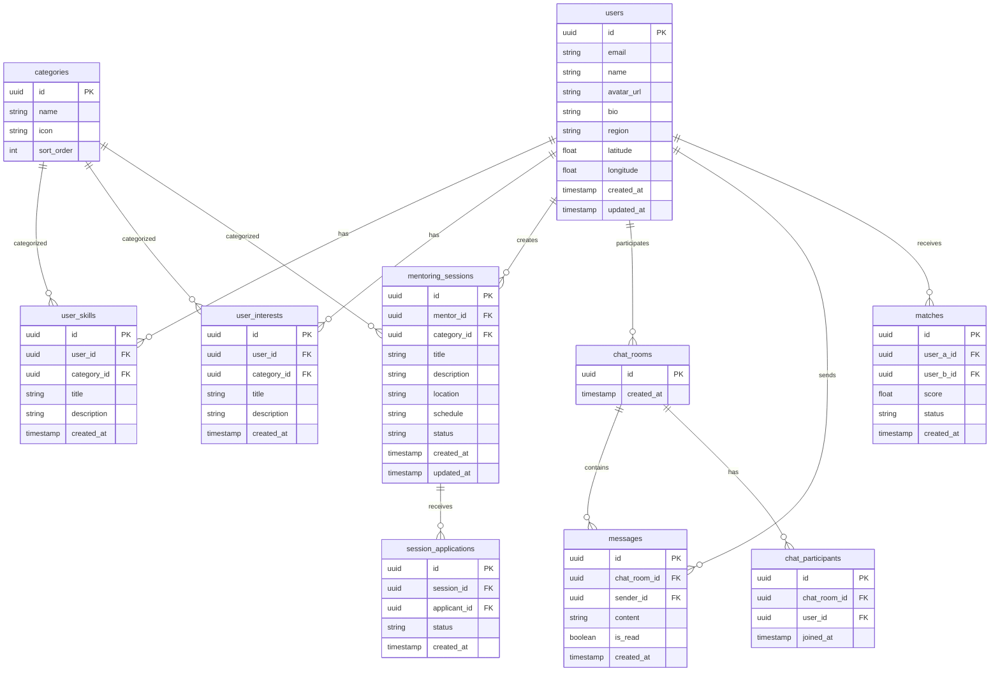

# MentorHub 데이터베이스 설계

## 1. ERD

---

## 2. 테이블 정의

### users (사용자)
| 컬럼 | 타입 | 제약 | 설명 |
|------|------|------|------|
| id | uuid | PK, DEFAULT gen_random_uuid() | 기본키 (Supabase Auth 연동) |
| email | varchar(255) | UNIQUE, NOT NULL | 이메일 |
| name | varchar(100) | NOT NULL | 표시 이름 |
| avatar_url | text | NULL | 프로필 이미지 URL |
| bio | text | NULL | 자기소개 |
| region | varchar(100) | NULL | 지역명 |
| latitude | float8 | NULL | 위도 |
| longitude | float8 | NULL | 경도 |
| created_at | timestamptz | DEFAULT now() | 생성일 |
| updated_at | timestamptz | DEFAULT now() | 수정일 |

### categories (카테고리)
| 컬럼 | 타입 | 제약 | 설명 |
|------|------|------|------|
| id | uuid | PK | 기본키 |
| name | varchar(50) | UNIQUE, NOT NULL | 카테고리명 (음악, 운동 등) |
| icon | varchar(10) | NULL | 이모지 아이콘 |
| sort_order | int | DEFAULT 0 | 정렬 순서 |

### user_skills (가르칠 수 있는 것)
| 컬럼 | 타입 | 제약 | 설명 |
|------|------|------|------|
| id | uuid | PK | 기본키 |
| user_id | uuid | FK → users.id | 사용자 |
| category_id | uuid | FK → categories.id | 카테고리 |
| title | varchar(100) | NOT NULL | 스킬명 (예: "기타 연주") |
| description | text | NULL | 상세 설명 |
| created_at | timestamptz | DEFAULT now() | 생성일 |

### user_interests (배우고 싶은 것)
| 컬럼 | 타입 | 제약 | 설명 |
|------|------|------|------|
| id | uuid | PK | 기본키 |
| user_id | uuid | FK → users.id | 사용자 |
| category_id | uuid | FK → categories.id | 카테고리 |
| title | varchar(100) | NOT NULL | 관심사명 (예: "피아노 배우기") |
| description | text | NULL | 상세 설명 |
| created_at | timestamptz | DEFAULT now() | 생성일 |

### mentoring_sessions (멘토링 세션)
| 컬럼 | 타입 | 제약 | 설명 |
|------|------|------|------|
| id | uuid | PK | 기본키 |
| mentor_id | uuid | FK → users.id | 멘토 |
| category_id | uuid | FK → categories.id | 카테고리 |
| title | varchar(200) | NOT NULL | 멘토링 제목 |
| description | text | NULL | 멘토링 내용 설명 |
| location | varchar(200) | NULL | 만남 장소 |
| schedule | varchar(200) | NULL | 일정 정보 |
| status | varchar(20) | DEFAULT 'active' | 상태 (active, closed, completed) |
| created_at | timestamptz | DEFAULT now() | 생성일 |
| updated_at | timestamptz | DEFAULT now() | 수정일 |

### session_applications (멘토링 신청)
| 컬럼 | 타입 | 제약 | 설명 |
|------|------|------|------|
| id | uuid | PK | 기본키 |
| session_id | uuid | FK → mentoring_sessions.id | 멘토링 세션 |
| applicant_id | uuid | FK → users.id | 신청자 |
| status | varchar(20) | DEFAULT 'pending' | 상태 (pending, accepted, rejected) |
| created_at | timestamptz | DEFAULT now() | 신청일 |

### matches (매칭 결과)
| 컬럼 | 타입 | 제약 | 설명 |
|------|------|------|------|
| id | uuid | PK | 기본키 |
| user_a_id | uuid | FK → users.id | 사용자 A |
| user_b_id | uuid | FK → users.id | 사용자 B |
| score | float4 | NOT NULL | 매칭 점수 (0~1) |
| status | varchar(20) | DEFAULT 'pending' | 상태 (pending, accepted, dismissed) |
| created_at | timestamptz | DEFAULT now() | 매칭일 |

### chat_rooms (채팅방)
| 컬럼 | 타입 | 제약 | 설명 |
|------|------|------|------|
| id | uuid | PK | 기본키 |
| created_at | timestamptz | DEFAULT now() | 생성일 |

### chat_participants (채팅 참여자)
| 컬럼 | 타입 | 제약 | 설명 |
|------|------|------|------|
| id | uuid | PK | 기본키 |
| chat_room_id | uuid | FK → chat_rooms.id | 채팅방 |
| user_id | uuid | FK → users.id | 참여자 |
| joined_at | timestamptz | DEFAULT now() | 참여일 |

### messages (메시지)
| 컬럼 | 타입 | 제약 | 설명 |
|------|------|------|------|
| id | uuid | PK | 기본키 |
| chat_room_id | uuid | FK → chat_rooms.id | 채팅방 |
| sender_id | uuid | FK → users.id | 발신자 |
| content | text | NOT NULL | 메시지 내용 |
| is_read | boolean | DEFAULT false | 읽음 여부 |
| created_at | timestamptz | DEFAULT now() | 발송일 |

---

## 3. 인덱스

| 테이블 | 컬럼 | 유형 | 이유 |
|--------|------|------|------|
| users | email | UNIQUE | 이메일 중복 방지 |
| users | region | INDEX | 지역별 검색 |
| user_skills | user_id | INDEX | 사용자별 스킬 조회 |
| user_skills | category_id | INDEX | 카테고리별 스킬 조회 |
| user_interests | user_id | INDEX | 사용자별 관심사 조회 |
| user_interests | category_id | INDEX | 카테고리별 관심사 조회 |
| mentoring_sessions | mentor_id | INDEX | 멘토별 세션 조회 |
| mentoring_sessions | category_id | INDEX | 카테고리별 세션 조회 |
| mentoring_sessions | status | INDEX | 활성 세션 필터링 |
| messages | chat_room_id | INDEX | 채팅방별 메시지 조회 |
| messages | created_at | INDEX | 최신 메시지 정렬 |
| matches | user_a_id, user_b_id | UNIQUE | 중복 매칭 방지 |

---

## 4. RLS (Row Level Security) 정책

| 테이블 | 정책 | 규칙 |
|--------|------|------|
| users | 본인만 수정 | UPDATE WHERE auth.uid() = id |
| messages | 참여자만 조회 | SELECT WHERE sender_id = auth.uid() OR chat_room_id IN (참여 채팅방) |
| chat_participants | 참여자만 조회 | SELECT WHERE user_id = auth.uid() |
| mentoring_sessions | 작성자만 수정 | UPDATE WHERE mentor_id = auth.uid() |
