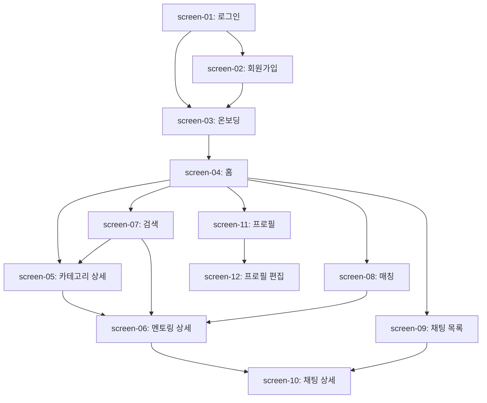

# MentorHub 화면 목록

> 이 문서는 /screen-spec의 입력으로 사용됩니다.

---

## 화면 목록

### screen-01: 로그인 화면
- **ID**: screen-01
- **경로**: /login
- **기능**: 소셜 로그인 (Google, Kakao), 이메일 로그인
- **컴포넌트**:
  - 로고
  - 소셜 로그인 버튼 (Google, Kakao)
  - 이메일 입력
  - 비밀번호 입력
  - 로그인 버튼
  - 회원가입 링크

### screen-02: 회원가입 화면
- **ID**: screen-02
- **경로**: /signup
- **기능**: 이메일 회원가입
- **컴포넌트**:
  - 이메일 입력
  - 비밀번호 입력
  - 이름 입력
  - 회원가입 버튼
  - 로그인 링크

### screen-03: 온보딩 화면
- **ID**: screen-03
- **경로**: /onboarding
- **기능**: 초기 관심사 설정, 프로필 기본 정보 입력
- **컴포넌트**:
  - 단계 진행 바 (Step Indicator)
  - 카테고리 선택 그리드 (관심사 복수 선택)
  - "가르칠 수 있는 것" 입력 폼
  - "배우고 싶은 것" 입력 폼
  - 지역 설정 입력
  - 다음/완료 버튼

### screen-04: 홈 화면
- **ID**: screen-04
- **경로**: /
- **기능**: 카테고리별 멘토링 탐색 (메인 진입점)
- **컴포넌트**:
  - 헤더 (로고, 알림 아이콘)
  - 검색 바 (간단 검색)
  - 카테고리 가로 스크롤 목록
  - 인기 멘토링 섹션
  - 최근 등록 멘토링 섹션
  - 하단 탭 네비게이션

### screen-05: 카테고리 상세 화면
- **ID**: screen-05
- **경로**: /category/:id
- **기능**: 특정 카테고리의 멘토 목록 표시
- **컴포넌트**:
  - 카테고리 헤더 (이름, 아이콘)
  - 필터 바 (지역, 정렬)
  - 멘토 카드 목록 (이름, 스킬, 지역, 간단 소개)
  - 무한 스크롤 / 더보기

### screen-06: 멘토링 상세 화면
- **ID**: screen-06
- **경로**: /mentoring/:id
- **기능**: 멘토링 세션 상세 정보 + 신청
- **컴포넌트**:
  - 멘토 프로필 카드 (이름, 사진, 자기소개)
  - "가르칠 수 있는 것" 섹션
  - 멘토링 정보 (시간, 장소, 내용)
  - 멘토링 신청 버튼
  - 뒤로가기 버튼

### screen-07: 검색 화면
- **ID**: screen-07
- **경로**: /search
- **기능**: 멘토/멘토링 통합 검색
- **컴포넌트**:
  - 검색 입력 필드 (자동 포커스)
  - 최근 검색어
  - 인기 검색어
  - 검색 결과 목록 (멘토 카드)
  - 필터 (카테고리, 지역)

### screen-08: 매칭 화면
- **ID**: screen-08
- **경로**: /matching
- **기능**: AI 추천 멘토 + 알림 기반 매칭 결과
- **컴포넌트**:
  - AI 추천 멘토 목록
  - 매칭 알림 목록
  - 멘토 카드 (매칭 점수 표시)
  - 수락/거절 버튼
  - 빈 상태 ("아직 매칭 결과가 없어요")

### screen-09: 채팅 목록 화면
- **ID**: screen-09
- **경로**: /chat
- **기능**: 1:1 채팅방 목록
- **컴포넌트**:
  - 채팅방 목록 (상대방 이름, 마지막 메시지, 시간)
  - 안 읽은 메시지 배지
  - 빈 상태 ("아직 대화가 없어요")

### screen-10: 채팅 상세 화면
- **ID**: screen-10
- **경로**: /chat/:id
- **기능**: 1:1 실시간 채팅
- **컴포넌트**:
  - 채팅 헤더 (상대방 이름, 프로필 링크)
  - 메시지 목록 (말풍선 형태)
  - 메시지 입력 필드
  - 전송 버튼
  - 스크롤 자동 이동

### screen-11: 프로필/마이페이지
- **ID**: screen-11
- **경로**: /profile
- **기능**: 내 프로필 확인 + 설정
- **컴포넌트**:
  - 프로필 이미지 + 이름
  - "가르칠 수 있는 것" 태그 목록
  - "배우고 싶은 것" 태그 목록
  - 자기소개
  - 멘토링 이력
  - 프로필 편집 버튼
  - 설정 (알림, 로그아웃)

### screen-12: 프로필 편집 화면
- **ID**: screen-12
- **경로**: /profile/edit
- **기능**: 프로필 정보 수정
- **컴포넌트**:
  - 프로필 이미지 변경
  - 이름 입력
  - 자기소개 입력
  - "가르칠 수 있는 것" 편집
  - "배우고 싶은 것" 편집
  - 지역 변경
  - 저장/취소 버튼

---

## 화면 간 이동

---

## 하단 탭 네비게이션

| 순서 | 탭 | 아이콘 | 경로 | 화면 |
|------|-----|--------|------|------|
| 1 | 홈 | Home | / | screen-04 |
| 2 | 검색 | Search | /search | screen-07 |
| 3 | 매칭 | Sparkles | /matching | screen-08 |
| 4 | 채팅 | MessageCircle | /chat | screen-09 |
| 5 | 프로필 | User | /profile | screen-11 |
