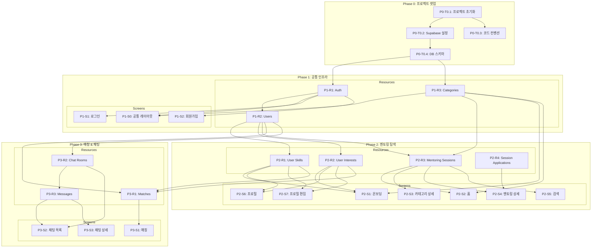

# MentorHub TASKS v2.0

> Domain-Guarded 화면 단위 태스크
> "화면이 주도하되, 도메인이 방어한다"

## 의존성 그래프

---

# Phase 0: 프로젝트 셋업

### [ ] P0-T0.1: Next.js 프로젝트 초기화
- **담당**: frontend-specialist
- **스펙**: Next.js 15 + TypeScript + Tailwind CSS + App Router 프로젝트 생성
- **파일**:
  - `package.json`
  - `next.config.ts`
  - `tailwind.config.ts`
  - `tsconfig.json`
  - `src/app/layout.tsx`
  - `src/app/globals.css`
- **완료 조건**:
  - [ ] `npm run dev` 정상 실행
  - [ ] TypeScript 컴파일 에러 없음

### [ ] P0-T0.2: Supabase 프로젝트 설정
- **담당**: backend-specialist
- **스펙**: Supabase 클라이언트 설정, 환경변수, SSR 지원
- **파일**:
  - `.env.local` (gitignore)
  - `src/lib/supabase/client.ts` (브라우저용)
  - `src/lib/supabase/server.ts` (서버용)
  - `src/lib/supabase/middleware.ts` (미들웨어용)
  - `src/middleware.ts`
- **완료 조건**:
  - [ ] Supabase 연결 성공
  - [ ] SSR/CSR 모두 클라이언트 동작

### [ ] P0-T0.3: 코드 컨벤션 설정
- **담당**: frontend-specialist
- **스펙**: ESLint + Prettier + Husky + lint-staged 설정
- **파일**:
  - `.eslintrc.json`
  - `.prettierrc`
  - `.husky/pre-commit`
- **완료 조건**:
  - [ ] `npm run lint` 정상
  - [ ] pre-commit 훅 동작

### [ ] P0-T0.4: DB 스키마 마이그레이션
- **담당**: database-specialist
- **스펙**: 10개 테이블 생성 + RLS 정책 + 카테고리 시드 데이터
- **리소스**: users, categories, user_skills, user_interests, mentoring_sessions, session_applications, matches, chat_rooms, chat_participants, messages
- **파일**:
  - `supabase/migrations/001_create_tables.sql`
  - `supabase/migrations/002_rls_policies.sql`
  - `supabase/seed.sql`
- **완료 조건**:
  - [ ] 모든 테이블 생성
  - [ ] RLS 정책 활성화
  - [ ] 카테고리 시드 데이터 삽입

---

# Phase 1: 공통 인프라 & 인증

## Resource 태스크

### [ ] P1-R1-T1: Auth 설정
- **담당**: backend-specialist
- **리소스**: auth (Supabase Auth)
- **스펙**: 소셜 로그인(Google, Kakao), 이메일 로그인, 세션 관리, 보호 라우트 미들웨어
- **필드**: user.id, user.email, session
- **파일**: `__tests__/lib/auth.test.ts` → `src/lib/supabase/auth.ts`, `src/hooks/useAuth.ts`
- **Worktree**: `worktree/phase-1-resources`
- **TDD**: RED → GREEN → REFACTOR
- **완료 조건**:
  - [ ] 소셜 로그인/로그아웃 동작
  - [ ] 이메일 회원가입/로그인 동작
  - [ ] 미들웨어 보호 라우트 동작

### [ ] P1-R2-T1: Users Resource 구현
- **담당**: backend-specialist
- **리소스**: users
- **스펙**: 사용자 프로필 CRUD, 아바타 Storage 업로드
- **필드**: id, email, name, avatar_url, bio, region, latitude, longitude
- **파일**: `__tests__/lib/users.test.ts` → `src/lib/api/users.ts`, `src/hooks/useProfile.ts`
- **Worktree**: `worktree/phase-1-resources`
- **TDD**: RED → GREEN → REFACTOR
- **의존**: P1-R1-T1
- **병렬**: P1-R3-T1과 병렬 가능

### [ ] P1-R3-T1: Categories Resource 구현
- **담당**: backend-specialist
- **리소스**: categories
- **스펙**: 카테고리 목록 조회 (시드 데이터 기반)
- **필드**: id, name, icon, sort_order
- **파일**: `__tests__/lib/categories.test.ts` → `src/lib/api/categories.ts`, `src/hooks/useCategories.ts`
- **Worktree**: `worktree/phase-1-resources`
- **TDD**: RED → GREEN → REFACTOR
- **의존**: P0-T0.4
- **병렬**: P1-R2-T1과 병렬 가능

---

## Screen 태스크

### P1-S0: 공통 레이아웃

#### [ ] P1-S0-T1: 공통 레이아웃 UI 구현
- **담당**: frontend-specialist
- **화면**: 전체 (공통)
- **컴포넌트**:
  - TabBar (하단 탭 네비게이션: 홈/검색/매칭/채팅/프로필)
  - AppHeader (로고, 알림 아이콘)
  - LoginModal (비로그인 시 로그인 유도)
  - EmptyState (데이터 없음 안내)
  - CategoryBadge (카테고리 태그/배지)
  - MentorCard (멘토 카드)
  - ChatRoomCard (채팅방 카드)
  - MessageBubble (채팅 메시지 말풍선)
- **데이터 요구**: categories (CategoryBadge)
- **파일**: `__tests__/components/layout/` → `src/components/layout/`, `src/components/ui/`, `src/components/features/`
- **스펙**: 8개 공통 컴포넌트 구현 (specs/shared/components.yaml 참조)
- **Worktree**: `worktree/phase-1-screens`
- **TDD**: RED → GREEN → REFACTOR
- **의존**: P1-R1-T1, P1-R3-T1

---

### P1-S1: 로그인 화면

> 화면: /login | 인증: 불필요

#### [ ] P1-S1-T1: 로그인 UI 구현
- **담당**: frontend-specialist
- **화면**: /login
- **컴포넌트**:
  - LoginForm (소셜 로그인 + 이메일 로그인)
  - SignupLink (회원가입 이동 버튼)
- **데이터 요구**: (없음)
- **파일**: `__tests__/app/login/page.test.tsx` → `src/app/(auth)/login/page.tsx`
- **스펙**: Google/Kakao 소셜 로그인, 이메일 로그인, 회원가입 이동
- **Worktree**: `worktree/phase-1-screens`
- **TDD**: RED → GREEN → REFACTOR
- **데모 상태**: default, loading, error
- **의존**: P1-R1-T1, P1-S0-T1

#### [ ] P1-S1-T2: 로그인 통합 테스트
- **담당**: test-specialist
- **화면**: /login
- **시나리오**:
  | 이름 | When | Then |
  |------|------|------|
  | 소셜 로그인 | Google 버튼 클릭 | OAuth 팝업 → 홈 이동 |
  | 이메일 로그인 | 이메일/비밀번호 입력 후 로그인 | 인증 성공 → 홈 이동 |
  | 회원가입 이동 | 회원가입 링크 클릭 | /signup 이동 |
- **파일**: `__tests__/e2e/login.spec.ts`
- **Worktree**: `worktree/phase-1-screens`

#### [ ] P1-S1-V: 로그인 연결점 검증
- **담당**: test-specialist
- **화면**: /login
- **검증 항목**:
  - [ ] Auth: Supabase Auth signInWithOAuth 동작
  - [ ] Auth: Supabase Auth signInWithPassword 동작
  - [ ] Navigation: signup_link → /signup 라우트 존재
  - [ ] Navigation: login_form → / 라우트 존재
  - [ ] Navigation: login_form → /onboarding 라우트 존재

---

### P1-S2: 회원가입 화면

> 화면: /signup | 인증: 불필요

#### [ ] P1-S2-T1: 회원가입 UI 구현
- **담당**: frontend-specialist
- **화면**: /signup
- **컴포넌트**:
  - SignupForm (이메일, 비밀번호, 이름 입력)
  - LoginLink (로그인 이동 버튼)
- **데이터 요구**: (없음)
- **파일**: `__tests__/app/signup/page.test.tsx` → `src/app/(auth)/signup/page.tsx`
- **스펙**: 이메일 회원가입, 유효성 검사, 중복 이메일 체크
- **Worktree**: `worktree/phase-1-screens`
- **TDD**: RED → GREEN → REFACTOR
- **데모 상태**: default, loading, error, validation-error
- **의존**: P1-R1-T1, P1-S0-T1

#### [ ] P1-S2-T2: 회원가입 통합 테스트
- **담당**: test-specialist
- **화면**: /signup
- **시나리오**:
  | 이름 | When | Then |
  |------|------|------|
  | 회원가입 성공 | 유효한 정보 입력 후 가입 | 계정 생성 → /onboarding 이동 |
  | 유효성 검사 실패 | 잘못된 이메일 입력 | 에러 메시지 표시 |
  | 중복 이메일 | 이미 가입된 이메일 | 에러 메시지 표시 |
- **파일**: `__tests__/e2e/signup.spec.ts`
- **Worktree**: `worktree/phase-1-screens`

#### [ ] P1-S2-V: 회원가입 연결점 검증
- **담당**: test-specialist
- **화면**: /signup
- **검증 항목**:
  - [ ] Auth: Supabase Auth signUp 동작
  - [ ] Navigation: signup_form → /onboarding 라우트 존재
  - [ ] Navigation: login_link → /login 라우트 존재

---

# Phase 2: 멘토링 탐색 & 프로필

## Resource 태스크

### [ ] P2-R1-T1: User Skills Resource 구현
- **담당**: backend-specialist
- **리소스**: user_skills
- **스펙**: 가르칠 수 있는 것 CRUD (유저별 스킬 관리)
- **필드**: id, user_id, category_id, title, description
- **파일**: `__tests__/lib/userSkills.test.ts` → `src/lib/api/userSkills.ts`, `src/hooks/useUserSkills.ts`
- **Worktree**: `worktree/phase-2-resources`
- **TDD**: RED → GREEN → REFACTOR
- **의존**: P1-R2-T1
- **병렬**: P2-R2-T1, P2-R3-T1과 병렬 가능

### [ ] P2-R2-T1: User Interests Resource 구현
- **담당**: backend-specialist
- **리소스**: user_interests
- **스펙**: 배우고 싶은 것 CRUD (유저별 관심사 관리)
- **필드**: id, user_id, category_id, title, description
- **파일**: `__tests__/lib/userInterests.test.ts` → `src/lib/api/userInterests.ts`, `src/hooks/useUserInterests.ts`
- **Worktree**: `worktree/phase-2-resources`
- **TDD**: RED → GREEN → REFACTOR
- **의존**: P1-R2-T1
- **병렬**: P2-R1-T1, P2-R3-T1과 병렬 가능

### [ ] P2-R3-T1: Mentoring Sessions Resource 구현
- **담당**: backend-specialist
- **리소스**: mentoring_sessions
- **스펙**: 멘토링 세션 CRUD (생성, 조회, 필터링, 상태 변경)
- **필드**: id, mentor_id, category_id, title, description, location, schedule, status
- **파일**: `__tests__/lib/mentoringSessions.test.ts` → `src/lib/api/mentoringSessions.ts`, `src/hooks/useMentoringSessions.ts`
- **Worktree**: `worktree/phase-2-resources`
- **TDD**: RED → GREEN → REFACTOR
- **의존**: P1-R2-T1, P1-R3-T1
- **병렬**: P2-R1-T1, P2-R2-T1과 병렬 가능

### [ ] P2-R4-T1: Session Applications Resource 구현
- **담당**: backend-specialist
- **리소스**: session_applications
- **스펙**: 멘토링 신청 CRUD (신청, 수락, 거절)
- **필드**: id, session_id, applicant_id, status
- **파일**: `__tests__/lib/sessionApplications.test.ts` → `src/lib/api/sessionApplications.ts`
- **Worktree**: `worktree/phase-2-resources`
- **TDD**: RED → GREEN → REFACTOR
- **의존**: P2-R3-T1
- **병렬**: 불가 (P2-R3-T1 완료 후)

---

## Screen 태스크

### P2-S1: 온보딩 화면

> 화면: /onboarding | 인증: 필수
> 데이터 요구: categories, user_skills, user_interests

#### [ ] P2-S1-T1: 온보딩 UI 구현
- **담당**: frontend-specialist
- **화면**: /onboarding
- **컴포넌트**:
  - StepIndicator (3단계 진행 표시)
  - CategorySelector (관심사 카테고리 복수 선택)
  - SkillsForm (가르칠 수 있는 것 입력)
  - InterestsForm (배우고 싶은 것 입력)
  - RegionInput (지역 설정)
  - CompleteButton (온보딩 완료)
- **데이터 요구**: categories, user_skills, user_interests
- **파일**: `__tests__/app/onboarding/page.test.tsx` → `src/app/onboarding/page.tsx`
- **스펙**: 3단계 온보딩 (카테고리 선택 → 스킬 입력 → 관심사 입력 → 지역)
- **Worktree**: `worktree/phase-2-onboarding`
- **TDD**: RED → GREEN → REFACTOR
- **데모 상태**: step1, step2, step3, complete
- **의존**: P1-R3-T1, P2-R1-T1, P2-R2-T1

#### [ ] P2-S1-T2: 온보딩 통합 테스트
- **담당**: test-specialist
- **화면**: /onboarding
- **시나리오**:
  | 이름 | When | Then |
  |------|------|------|
  | 카테고리 선택 | 2개 이상 선택 | 하이라이트, 다음 버튼 활성화 |
  | 스킬 등록 | 가르칠 수 있는 것 입력 | user_skills 저장, 다음 단계 |
  | 온보딩 완료 | 모든 단계 완료 | 홈으로 이동, 프로필 저장 |
- **파일**: `__tests__/e2e/onboarding.spec.ts`
- **Worktree**: `worktree/phase-2-onboarding`

#### [ ] P2-S1-V: 온보딩 연결점 검증
- **담당**: test-specialist
- **화면**: /onboarding
- **검증 항목**:
  - [ ] Field Coverage: categories.[id,name,icon] 존재
  - [ ] Data: user_skills CRUD 동작
  - [ ] Data: user_interests CRUD 동작
  - [ ] Auth: 비로그인 시 /login 리다이렉트
  - [ ] Navigation: complete_button → / 라우트 존재

---

### P2-S2: 홈 화면

> 화면: / | 인증: 불필요
> 데이터 요구: categories, mentoring_sessions, users

#### [ ] P2-S2-T1: 홈 UI 구현
- **담당**: frontend-specialist
- **화면**: /
- **컴포넌트**:
  - AppHeader (로고, 알림)
  - SearchBar (검색 이동)
  - CategoryScroll (카테고리 가로 스크롤)
  - PopularSection (인기 멘토링)
  - RecentSection (최근 멘토링)
  - TabBar (하단 탭)
- **데이터 요구**: categories, mentoring_sessions, users
- **파일**: `__tests__/app/home/page.test.tsx` → `src/app/(main)/page.tsx`
- **스펙**: 카테고리 캐러셀, 인기/최근 멘토링 섹션, 비로그인 접근 가능
- **Worktree**: `worktree/phase-2-home`
- **TDD**: RED → GREEN → REFACTOR
- **데모 상태**: loading, empty, normal, logged-out
- **의존**: P1-R3-T1, P2-R3-T1, P1-S0-T1

#### [ ] P2-S2-T2: 홈 통합 테스트
- **담당**: test-specialist
- **화면**: /
- **시나리오**:
  | 이름 | When | Then |
  |------|------|------|
  | 초기 로드 | 페이지 접속 | 카테고리, 인기/최근 멘토링 표시 |
  | 카테고리 클릭 | 카테고리 선택 | /category/:id 이동 |
  | 멘토링 카드 클릭 | 카드 선택 | /mentoring/:id 이동 |
  | 비로그인 접근 | 비로그인 접속 | 탐색 가능, 로그인 버튼 표시 |
- **파일**: `__tests__/e2e/home.spec.ts`
- **Worktree**: `worktree/phase-2-home`

#### [ ] P2-S2-V: 홈 연결점 검증
- **담당**: test-specialist
- **화면**: /
- **검증 항목**:
  - [ ] Field Coverage: categories.[id,name,icon] 존재
  - [ ] Field Coverage: mentoring_sessions.[id,title,description,location,mentor_id] 존재
  - [ ] Field Coverage: users.[id,name,avatar_url,region] 존재
  - [ ] Navigation: category_scroll → /category/:id 라우트 존재
  - [ ] Navigation: popular_section → /mentoring/:id 라우트 존재
  - [ ] SharedComponent: TabBar 렌더링

---

### P2-S3: 카테고리 상세 화면

> 화면: /category/:id | 인증: 불필요
> 데이터 요구: categories, mentoring_sessions, users

#### [ ] P2-S3-T1: 카테고리 상세 UI 구현
- **담당**: frontend-specialist
- **화면**: /category/:id
- **컴포넌트**:
  - CategoryHeader (카테고리 이름, 아이콘)
  - FilterBar (지역, 정렬 필터)
  - MentorList (멘토 카드 목록, 무한 스크롤)
- **데이터 요구**: categories, mentoring_sessions, users
- **파일**: `__tests__/app/category/page.test.tsx` → `src/app/(main)/category/[id]/page.tsx`
- **스펙**: 카테고리별 멘토 목록, 필터링, 무한 스크롤
- **Worktree**: `worktree/phase-2-browse`
- **TDD**: RED → GREEN → REFACTOR
- **데모 상태**: loading, empty, normal, filtered
- **의존**: P1-R3-T1, P2-R3-T1, P1-S0-T1

#### [ ] P2-S3-T2: 카테고리 상세 통합 테스트
- **담당**: test-specialist
- **화면**: /category/:id
- **시나리오**:
  | 이름 | When | Then |
  |------|------|------|
  | 멘토 표시 | /category/music 접속 | 음악 카테고리 멘토 목록 |
  | 필터링 | 지역 "강남구" 선택 | 강남구 멘토만 표시 |
  | 멘토 상세 이동 | 카드 클릭 | /mentoring/:id 이동 |
- **파일**: `__tests__/e2e/category-detail.spec.ts`
- **Worktree**: `worktree/phase-2-browse`

#### [ ] P2-S3-V: 카테고리 상세 연결점 검증
- **담당**: test-specialist
- **화면**: /category/:id
- **검증 항목**:
  - [ ] Field Coverage: categories.[id,name,icon] 존재
  - [ ] Field Coverage: mentoring_sessions.[id,title,description,location,schedule,mentor_id,category_id] 존재
  - [ ] Navigation: mentor_list → /mentoring/:id 라우트 존재
  - [ ] SharedComponent: TabBar 렌더링

---

### P2-S4: 멘토링 상세 화면

> 화면: /mentoring/:id | 인증: 불필요 (신청 시 필요)
> 데이터 요구: mentoring_sessions, users, user_skills

#### [ ] P2-S4-T1: 멘토링 상세 UI 구현
- **담당**: frontend-specialist
- **화면**: /mentoring/:id
- **컴포넌트**:
  - MentorProfileCard (멘토 프로필)
  - SkillsSection (가르칠 수 있는 것 목록)
  - SessionInfo (멘토링 정보: 시간, 장소, 내용)
  - ApplyButton (멘토링 신청 + 로그인 체크)
- **데이터 요구**: mentoring_sessions, users, user_skills
- **파일**: `__tests__/app/mentoring/page.test.tsx` → `src/app/(main)/mentoring/[id]/page.tsx`
- **스펙**: 멘토 프로필, 스킬 목록, 멘토링 정보, 신청 버튼 (비로그인 시 LoginModal)
- **Worktree**: `worktree/phase-2-browse`
- **TDD**: RED → GREEN → REFACTOR
- **데모 상태**: loading, normal, applied, logged-out
- **의존**: P2-R3-T1, P2-R4-T1, P2-R1-T1, P1-S0-T1

#### [ ] P2-S4-T2: 멘토링 상세 통합 테스트
- **담당**: test-specialist
- **화면**: /mentoring/:id
- **시나리오**:
  | 이름 | When | Then |
  |------|------|------|
  | 정보 표시 | /mentoring/123 접속 | 멘토 프로필, 스킬, 멘토링 정보 표시 |
  | 신청 (로그인) | 로그인 후 신청 클릭 | 신청 생성, 채팅방 생성, /chat/:id 이동 |
  | 신청 (비로그인) | 비로그인 상태 신청 | LoginModal 표시 |
- **파일**: `__tests__/e2e/mentoring-detail.spec.ts`
- **Worktree**: `worktree/phase-2-browse`

#### [ ] P2-S4-V: 멘토링 상세 연결점 검증
- **담당**: test-specialist
- **화면**: /mentoring/:id
- **검증 항목**:
  - [ ] Field Coverage: mentoring_sessions.[id,title,description,location,schedule,status,mentor_id,category_id] 존재
  - [ ] Field Coverage: users.[id,name,avatar_url,bio,region] 존재
  - [ ] Field Coverage: user_skills.[id,title,description,category_id] 존재
  - [ ] Data: session_applications 신청 CRUD 동작
  - [ ] Auth: 비로그인 시 LoginModal 표시
  - [ ] Navigation: apply_button → /chat/:id 라우트 존재

---

### P2-S5: 검색 화면

> 화면: /search | 인증: 불필요
> 데이터 요구: mentoring_sessions, categories, users

#### [ ] P2-S5-T1: 검색 UI 구현
- **담당**: frontend-specialist
- **화면**: /search
- **컴포넌트**:
  - SearchInput (자동 포커스 검색 입력)
  - RecentSearches (최근 검색어)
  - PopularSearches (인기 검색어)
  - SearchResults (검색 결과 카드 목록)
  - CategoryFilter (카테고리, 지역 필터)
- **데이터 요구**: mentoring_sessions, categories, users
- **파일**: `__tests__/app/search/page.test.tsx` → `src/app/(main)/search/page.tsx`
- **스펙**: 검색 입력, 디바운스 자동 검색, 최근/인기 검색어, 필터, 결과 없음 안내
- **Worktree**: `worktree/phase-2-search`
- **TDD**: RED → GREEN → REFACTOR
- **데모 상태**: initial, searching, results, no-results
- **의존**: P2-R3-T1, P1-R3-T1, P1-S0-T1

#### [ ] P2-S5-T2: 검색 통합 테스트
- **담당**: test-specialist
- **화면**: /search
- **시나리오**:
  | 이름 | When | Then |
  |------|------|------|
  | 초기 상태 | /search 접속 | 검색 포커스, 최근/인기 검색어 표시 |
  | 검색 실행 | "기타" 입력 | 기타 관련 결과 표시 |
  | 결과 없음 | 없는 키워드 검색 | 결과 없음 안내 |
- **파일**: `__tests__/e2e/search.spec.ts`
- **Worktree**: `worktree/phase-2-search`

#### [ ] P2-S5-V: 검색 연결점 검증
- **담당**: test-specialist
- **화면**: /search
- **검증 항목**:
  - [ ] Field Coverage: mentoring_sessions.[id,title,description,location,mentor_id,category_id] 존재
  - [ ] Field Coverage: categories.[id,name] 존재
  - [ ] Navigation: search_results → /mentoring/:id 라우트 존재
  - [ ] SharedComponent: TabBar 렌더링
  - [ ] SharedComponent: EmptyState 렌더링

---

### P2-S6: 프로필 화면

> 화면: /profile | 인증: 필수
> 데이터 요구: users, user_skills, user_interests, mentoring_sessions

#### [ ] P2-S6-T1: 프로필 UI 구현
- **담당**: frontend-specialist
- **화면**: /profile
- **컴포넌트**:
  - ProfileHeader (프로필 이미지, 이름, 지역)
  - SkillsTags (가르칠 수 있는 것 태그)
  - InterestsTags (배우고 싶은 것 태그)
  - BioSection (자기소개)
  - MentoringHistory (멘토링 이력)
  - EditButton (편집 이동)
  - SettingsSection (알림 설정, 로그아웃)
- **데이터 요구**: users, user_skills, user_interests, mentoring_sessions
- **파일**: `__tests__/app/profile/page.test.tsx` → `src/app/(main)/profile/page.tsx`
- **스펙**: 프로필 정보 표시, 스킬/관심사 태그, 멘토링 이력, 로그아웃
- **Worktree**: `worktree/phase-2-profile`
- **TDD**: RED → GREEN → REFACTOR
- **데모 상태**: loading, normal, no-skills, no-history
- **의존**: P1-R2-T1, P2-R1-T1, P2-R2-T1, P2-R3-T1, P1-S0-T1

#### [ ] P2-S6-T2: 프로필 통합 테스트
- **담당**: test-specialist
- **화면**: /profile
- **시나리오**:
  | 이름 | When | Then |
  |------|------|------|
  | 정보 표시 | /profile 접속 | 프로필 이미지, 이름, 스킬/관심사 태그 |
  | 편집 이동 | 편집 버튼 클릭 | /profile/edit 이동 |
  | 로그아웃 | 로그아웃 클릭 | 세션 종료, /login 이동 |
- **파일**: `__tests__/e2e/profile.spec.ts`
- **Worktree**: `worktree/phase-2-profile`

#### [ ] P2-S6-V: 프로필 연결점 검증
- **담당**: test-specialist
- **화면**: /profile
- **검증 항목**:
  - [ ] Field Coverage: users.[id,name,avatar_url,bio,region] 존재
  - [ ] Field Coverage: user_skills.[id,title,description,category_id] 존재
  - [ ] Field Coverage: user_interests.[id,title,description,category_id] 존재
  - [ ] Field Coverage: mentoring_sessions.[id,title,status,created_at] 존재
  - [ ] Auth: 비로그인 시 /login 리다이렉트
  - [ ] Navigation: edit_button → /profile/edit 라우트 존재
  - [ ] Navigation: settings_section → /login 라우트 존재 (로그아웃)
  - [ ] SharedComponent: TabBar 렌더링

---

### P2-S7: 프로필 편집 화면

> 화면: /profile/edit | 인증: 필수
> 데이터 요구: users, user_skills, user_interests, categories

#### [ ] P2-S7-T1: 프로필 편집 UI 구현
- **담당**: frontend-specialist
- **화면**: /profile/edit
- **컴포넌트**:
  - AvatarUpload (프로필 이미지 변경, Supabase Storage)
  - ProfileForm (이름, 자기소개, 지역 수정)
  - SkillsEditor (가르칠 수 있는 것 추가/삭제/수정)
  - InterestsEditor (배우고 싶은 것 추가/삭제/수정)
  - ActionButtons (저장/취소)
- **데이터 요구**: users, user_skills, user_interests, categories
- **파일**: `__tests__/app/profile/edit/page.test.tsx` → `src/app/(main)/profile/edit/page.tsx`
- **스펙**: 프로필 편집 폼, 이미지 업로드, 스킬/관심사 CRUD, 저장/취소
- **Worktree**: `worktree/phase-2-profile`
- **TDD**: RED → GREEN → REFACTOR
- **데모 상태**: loading, editing, saving
- **의존**: P1-R2-T1, P2-R1-T1, P2-R2-T1, P1-R3-T1, P1-S0-T1

#### [ ] P2-S7-T2: 프로필 편집 통합 테스트
- **담당**: test-specialist
- **화면**: /profile/edit
- **시나리오**:
  | 이름 | When | Then |
  |------|------|------|
  | 기존 정보 로드 | /profile/edit 접속 | 기존 프로필 정보 폼에 채워짐 |
  | 프로필 저장 | 정보 수정 후 저장 | 변경사항 저장, /profile 이동, 토스트 |
  | 스킬 추가 | 가르칠 수 있는 것 추가 | 새 입력 폼, 카테고리 선택 가능 |
  | 취소 | 취소 클릭 | 변경 미저장, /profile 이동 |
- **파일**: `__tests__/e2e/profile-edit.spec.ts`
- **Worktree**: `worktree/phase-2-profile`

#### [ ] P2-S7-V: 프로필 편집 연결점 검증
- **담당**: test-specialist
- **화면**: /profile/edit
- **검증 항목**:
  - [ ] Field Coverage: users.[id,name,avatar_url,bio,region] 존재
  - [ ] Field Coverage: user_skills.[id,title,description,category_id] 존재
  - [ ] Field Coverage: user_interests.[id,title,description,category_id] 존재
  - [ ] Field Coverage: categories.[id,name] 존재
  - [ ] Data: Supabase Storage 아바타 업로드 동작
  - [ ] Auth: 비로그인 시 /login 리다이렉트
  - [ ] Navigation: action_buttons → /profile 라우트 존재

---

# Phase 3: 매칭 & 채팅

## Resource 태스크

### [ ] P3-R1-T1: Matches Resource 구현
- **담당**: backend-specialist
- **리소스**: matches
- **스펙**: 매칭 CRUD + 추천 알고리즘 (스킬/관심사 교차 매칭, 점수 계산)
- **필드**: id, user_a_id, user_b_id, score, status
- **파일**: `__tests__/lib/matches.test.ts` → `src/lib/api/matches.ts`, `src/hooks/useMatches.ts`
- **Worktree**: `worktree/phase-3-resources`
- **TDD**: RED → GREEN → REFACTOR
- **의존**: P1-R2-T1, P2-R1-T1, P2-R2-T1
- **병렬**: P3-R2-T1과 병렬 가능

### [ ] P3-R2-T1: Chat Rooms Resource 구현
- **담당**: backend-specialist
- **리소스**: chat_rooms, chat_participants
- **스펙**: 채팅방 생성/조회, 참가자 관리, 마지막 메시지 집계
- **필드**: chat_rooms.[id, created_at], chat_participants.[chat_room_id, user_id]
- **파일**: `__tests__/lib/chatRooms.test.ts` → `src/lib/api/chatRooms.ts`, `src/hooks/useChatRooms.ts`
- **Worktree**: `worktree/phase-3-resources`
- **TDD**: RED → GREEN → REFACTOR
- **의존**: P1-R2-T1
- **병렬**: P3-R1-T1과 병렬 가능

### [ ] P3-R3-T1: Messages Resource 구현
- **담당**: backend-specialist
- **리소스**: messages
- **스펙**: 메시지 CRUD + Supabase Realtime 구독 (실시간 수신, 읽음 처리)
- **필드**: id, chat_room_id, sender_id, content, is_read, created_at
- **파일**: `__tests__/lib/messages.test.ts` → `src/lib/api/messages.ts`, `src/hooks/useMessages.ts`, `src/hooks/useRealtimeMessages.ts`
- **Worktree**: `worktree/phase-3-resources`
- **TDD**: RED → GREEN → REFACTOR
- **의존**: P3-R2-T1
- **병렬**: 불가 (P3-R2-T1 완료 후)

---

## Screen 태스크

### P3-S1: 매칭 화면

> 화면: /matching | 인증: 필수
> 데이터 요구: matches, users, user_skills, user_interests

#### [ ] P3-S1-T1: 매칭 UI 구현
- **담당**: frontend-specialist
- **화면**: /matching
- **컴포넌트**:
  - RecommendedList (AI 추천 멘토 카드 + 매칭 점수)
  - MatchActions (수락/거절 버튼)
  - EmptyState (매칭 결과 없음 안내)
- **데이터 요구**: matches, users, user_skills, user_interests
- **파일**: `__tests__/app/matching/page.test.tsx` → `src/app/(main)/matching/page.tsx`
- **스펙**: AI 추천 목록, 매칭 점수 표시, 수락 시 채팅방 생성, 빈 상태 안내
- **Worktree**: `worktree/phase-3-matching`
- **TDD**: RED → GREEN → REFACTOR
- **데모 상태**: loading, normal, empty
- **의존**: P3-R1-T1, P1-S0-T1

#### [ ] P3-S1-T2: 매칭 통합 테스트
- **담당**: test-specialist
- **화면**: /matching
- **시나리오**:
  | 이름 | When | Then |
  |------|------|------|
  | 추천 목록 | 매칭 결과 있음 | 추천 카드 목록 + 점수 표시 |
  | 매칭 수락 | 수락 클릭 | 상태 변경, 채팅방 생성, 채팅 이동 |
  | 빈 상태 | 매칭 결과 없음 | 빈 상태 안내 + 관심사 추가 유도 |
- **파일**: `__tests__/e2e/matching.spec.ts`
- **Worktree**: `worktree/phase-3-matching`

#### [ ] P3-S1-V: 매칭 연결점 검증
- **담당**: test-specialist
- **화면**: /matching
- **검증 항목**:
  - [ ] Field Coverage: matches.[id,user_a_id,user_b_id,score,status] 존재
  - [ ] Field Coverage: users.[id,name,avatar_url,bio,region] 존재
  - [ ] Field Coverage: user_skills.[id,title,category_id] 존재
  - [ ] Field Coverage: user_interests.[id,title,category_id] 존재
  - [ ] Auth: 비로그인 시 /login 리다이렉트
  - [ ] Navigation: recommended_list → /mentoring/:id 라우트 존재
  - [ ] Navigation: match_actions → /chat/:id 라우트 존재
  - [ ] SharedComponent: TabBar 렌더링
  - [ ] SharedComponent: EmptyState 렌더링

---

### P3-S2: 채팅 목록 화면

> 화면: /chat | 인증: 필수
> 데이터 요구: chat_rooms, chat_participants, messages, users

#### [ ] P3-S2-T1: 채팅 목록 UI 구현
- **담당**: frontend-specialist
- **화면**: /chat
- **컴포넌트**:
  - ChatRoomList (채팅방 목록: 상대방 이름, 마지막 메시지, 시간, 안 읽은 수)
  - EmptyState (채팅 없음 안내)
- **데이터 요구**: chat_rooms, chat_participants, messages, users
- **파일**: `__tests__/app/chat/page.test.tsx` → `src/app/(main)/chat/page.tsx`
- **스펙**: 채팅방 목록, 마지막 메시지 표시, 안 읽은 배지, 빈 상태
- **Worktree**: `worktree/phase-3-chat`
- **TDD**: RED → GREEN → REFACTOR
- **데모 상태**: loading, normal, empty, unread
- **의존**: P3-R2-T1, P3-R3-T1, P1-S0-T1

#### [ ] P3-S2-T2: 채팅 목록 통합 테스트
- **담당**: test-specialist
- **화면**: /chat
- **시나리오**:
  | 이름 | When | Then |
  |------|------|------|
  | 목록 표시 | 채팅방 있음 | 채팅방 목록 + 마지막 메시지 + 안 읽은 배지 |
  | 채팅방 진입 | 채팅방 클릭 | /chat/:id 이동 |
  | 빈 상태 | 채팅방 없음 | 빈 상태 안내 |
- **파일**: `__tests__/e2e/chat-list.spec.ts`
- **Worktree**: `worktree/phase-3-chat`

#### [ ] P3-S2-V: 채팅 목록 연결점 검증
- **담당**: test-specialist
- **화면**: /chat
- **검증 항목**:
  - [ ] Field Coverage: chat_rooms.[id,created_at] 존재
  - [ ] Field Coverage: chat_participants.[chat_room_id,user_id] 존재
  - [ ] Field Coverage: messages.[id,chat_room_id,content,is_read,created_at,sender_id] 존재
  - [ ] Field Coverage: users.[id,name,avatar_url] 존재
  - [ ] Auth: 비로그인 시 /login 리다이렉트
  - [ ] Navigation: chat_room_list → /chat/:id 라우트 존재
  - [ ] SharedComponent: TabBar 렌더링
  - [ ] SharedComponent: EmptyState 렌더링

---

### P3-S3: 채팅 상세 화면

> 화면: /chat/:id | 인증: 필수
> 데이터 요구: messages, users, chat_participants

#### [ ] P3-S3-T1: 채팅 상세 UI 구현
- **담당**: frontend-specialist
- **화면**: /chat/:id
- **컴포넌트**:
  - ChatHeader (상대방 이름, 프로필 링크, 뒤로가기)
  - MessageList (메시지 말풍선 목록, Supabase Realtime)
  - MessageInput (메시지 입력 + 전송 버튼)
- **데이터 요구**: messages, users, chat_participants
- **파일**: `__tests__/app/chat/detail/page.test.tsx` → `src/app/(main)/chat/[id]/page.tsx`
- **스펙**: 실시간 메시지 송수신, 말풍선 UI, 읽음 처리, 이전 메시지 로드
- **Worktree**: `worktree/phase-3-chat`
- **TDD**: RED → GREEN → REFACTOR
- **데모 상태**: loading, normal, sending, receiving
- **의존**: P3-R3-T1, P3-R2-T1, P1-S0-T1

#### [ ] P3-S3-T2: 채팅 상세 통합 테스트
- **담당**: test-specialist
- **화면**: /chat/:id
- **시나리오**:
  | 이름 | When | Then |
  |------|------|------|
  | 메시지 로드 | /chat/123 접속 | 기존 메시지 표시, 스크롤 최하단 |
  | 메시지 전송 | 메시지 입력 후 전송 | 화면 추가, 상대방에게 실시간 전달 |
  | 실시간 수신 | 상대방 메시지 전송 | 새 메시지 실시간 표시, 읽음 처리 |
  | 이전 메시지 | 위로 스크롤 | 이전 메시지 추가 로드 |
- **파일**: `__tests__/e2e/chat-detail.spec.ts`
- **Worktree**: `worktree/phase-3-chat`

#### [ ] P3-S3-V: 채팅 상세 연결점 검증
- **담당**: test-specialist
- **화면**: /chat/:id
- **검증 항목**:
  - [ ] Field Coverage: messages.[id,content,sender_id,is_read,created_at] 존재
  - [ ] Field Coverage: users.[id,name,avatar_url] 존재
  - [ ] Field Coverage: chat_participants.[chat_room_id,user_id] 존재
  - [ ] Realtime: Supabase Realtime 구독 동작
  - [ ] Auth: 비로그인 시 /login 리다이렉트
  - [ ] Auth: 채팅방 참가자만 접근 가능
  - [ ] Navigation: chat_header → /chat 라우트 존재

---

# 태스크 요약

## 전체 태스크 수

| Phase | Resource | Screen UI | 통합 테스트 | 연결점 검증 | 합계 |
|-------|----------|-----------|------------|------------|------|
| P0 | - | - | - | - | 4 |
| P1 | 3 | 3 | 2 | 2 | 10 |
| P2 | 4 | 7 | 7 | 7 | 25 |
| P3 | 3 | 3 | 3 | 3 | 12 |
| **합계** | **10** | **13** | **12** | **12** | **51** |

## 병렬 실행 가능 그룹

| Phase | 그룹 | 태스크 |
|-------|------|--------|
| P0 | Setup | P0-T0.1 → P0-T0.2 → P0-T0.4 (순차), P0-T0.3 (P0-T0.1 이후 병렬) |
| P1 | Resources | P1-R2-T1, P1-R3-T1 (병렬) |
| P2 | Resources | P2-R1-T1, P2-R2-T1, P2-R3-T1 (병렬) |
| P2 | Screens | P2-S2, P2-S3, P2-S5 (병렬 가능) / P2-S6, P2-S7 (병렬 가능) |
| P3 | Resources | P3-R1-T1, P3-R2-T1 (병렬) |
| P3 | Screens | P3-S1 (독립) / P3-S2, P3-S3 (순차) |

## 담당자별 태스크 수

| 담당 | 태스크 수 |
|------|----------|
| frontend-specialist | 17 (P0 셋업 2 + Screen UI 13 + 공통 레이아웃 1 + 컨벤션 1) |
| backend-specialist | 11 (Supabase 설정 1 + Resource 10) |
| database-specialist | 1 (DB 스키마) |
| test-specialist | 22 (통합 테스트 12 + 연결점 검증 10) |
